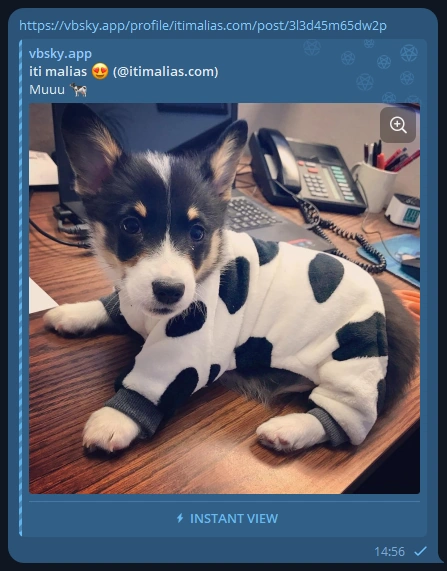
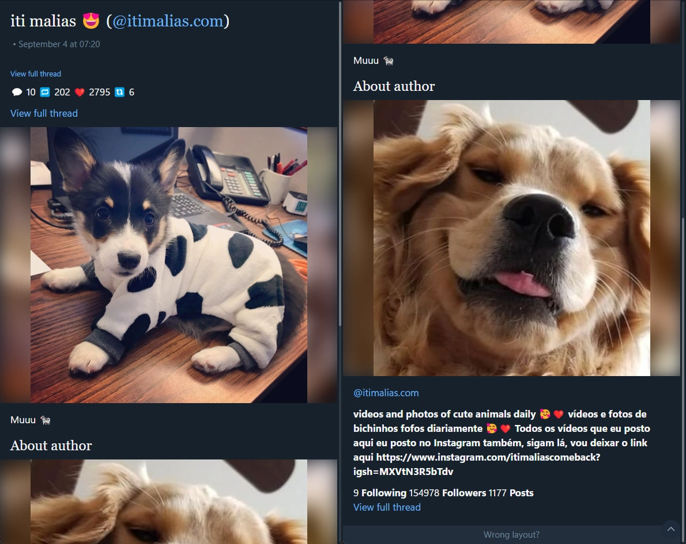
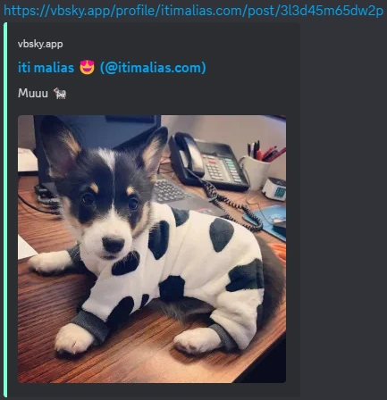

# [vbsky.app](https://vbsky.app): Embed generator for Bluesky!
This project generates embeds for platforms like [Discord](https://discord.com) and [Telegram](https://telegram.org) (with support for [Instant Views](https://instantview.telegram.org/)!)

## Example
You can shrimply add a `v` before `bsky.app` to turn it into an embed, so for example, this url would become\
`https://bsky.app/profile/userhandle/post/wowzerssomepostid`\
`https://vbsky.app/profile/userhandle/post/wowzerssomepostid`

## Screenshots
Here's some examples of the final result we can generate!

### Telegram

#### We can also generate instant views


### Discord


## Running
Interested in running the project just to know how it works or to help contribute?

### 1. Installing the dependencies
I highly recommend using a Python virtual environment (like [venv](https://docs.python.org/3/library/venv.html), [conda](https://conda.io/projects/conda/en/latest/user-guide/getting-started.html), ...)

```bash
$ pip install -r requirements.txt
```

### 2. Running the project in local mode via FastAPI
You can run the project locally with auto reload utilizing the FastAPI CLI

```bash
$ fastapi dev app/main.py
```

## Deploying
So you're interested in deploying the project? I highly recommend going with the Docker Compose route

### Utilizing Docker Compose
To run the docker-compose.yml file you can do

```bash
$ docker compose up -d --build
```

### Utilizing FastAPI (unsupported/not preferred)
If you still want to go down this route, you can run it using FastAPI directly by executing

```bash
$ fastapi run app/main.py
```